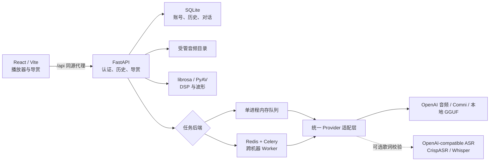

# Music Insight

Music Insight 是一个本地优先、证据驱动的音乐理解与演唱练习应用。用户上传
歌曲后，可以获得声学分析、歌词与声音证据、结构化音乐导赏，并在同一个
播放器旁就具体时间段持续追问；也可以上传或录制自己的演唱，与参考音频做
本地声学评分。

核心能力：

- 歌词、乐器/声源、声音事件、情绪线索、BPM、调性和声学能量分析；
- 结构化“音乐理解地图”：从听觉事实到表达解释、段落作用与复听任务；
- 边听边问、当前 15 秒解释、波形框选、A/B 片段比较和同步歌词；
- 本地文件或受限公网直接音频 URL 导入；
- 多账号隔离的历史、歌曲级多对话、结果对比、歌词校对与版本回溯；
- 参考音频与个人演唱的本地 DSP 评分、个人成绩历史和娱乐排行榜；
- 可选的独立 ASR 歌词二次验证，统一模型失败时仍可明确降级；
- OpenAI `input_audio`、MiniCPM-o Comni 和本地 GGUF Provider；
- 内存任务模式，以及可选的 Redis/Celery 跨进程分析 Worker。

正式界面使用 React + TypeScript + Vite，FastAPI 提供认证、异步任务、
SSE 进度、历史和导赏 API；Streamlit 只保留为兼容调试台。模型权重、
运行时缓存和 `test_samples/` 中的本地测试音频由 `.gitignore` 排除；放在
项目根目录等其他位置的个人媒体文件仍应避免加入 Git。

文档导航：
[快速开始](#快速开始) ·
[使用流程](#使用流程) ·
[产品需求](docs/product-requirements.md) ·
[架构](#架构概览) ·
[导赏老师](#可交互音乐导赏老师) ·
[局域网运行](#运行方式与局域网) ·
[API](#api) ·
[配置](#配置) ·
[常见问题](#常见问题) ·
[验证](#验证)

## 快速开始

环境要求：

- Python 3.11 或更高版本；
- Node.js `>=22.12.0`，以及 pnpm；
- 完整歌词、情绪与导赏能力需要至少一个可访问的音频模型服务；没有模型时
  仍可启动应用并验证界面和 DSP 降级链路；
- 本地 GGUF 模式额外需要支持音频投影的 `llama-server`。

在项目根目录安装并启动后端：

```bash
python -m venv .venv
.venv/bin/pip install ".[dev]"
PYTHONPATH=src .venv/bin/python -m uvicorn \
  music_insight.api.app:app --host 127.0.0.1 --port 8000
```

另开终端启动正式前端：

```bash
cd frontend
pnpm install --frozen-lockfile
pnpm dev
```

然后打开：

- 正式界面：`http://127.0.0.1:5174/`
- API、Debug Console：`http://127.0.0.1:8000/`
- OpenAPI 文档：`http://127.0.0.1:8000/docs`

首次使用时在正式界面创建本地账号。上传歌曲并完成分析后，打开左侧历史项，
系统会从已保存证据自动准备基础音乐理解地图，可以直接进入边听边问；如需更
丰富的开放解释，可再使用当前歌曲保存的 Provider 增强导赏。模型地址和本地
权重路径在页面右上角“模型设置”中选择。设置会用于之后新建的分析，直到再次
修改或退出账号；不会改变正在运行的任务或已有结果。

当前代码内置以下模型预设，它们不是运行整个应用的硬依赖：

- Qwen3-Omni 音频理解：`http://192.168.1.97:8004`
- MiniCPM-o 4.5 Comni Gateway：`http://192.168.1.97:8005`
- 可选 CrispASR/MiMo 歌词验证（`crisp_asr` 方言）：
  `http://192.168.1.97:8003`
- 本地 Qwen2.5-Omni-3B Q8 GGUF：放入权重后默认从 `src/model/` 查找

`8003`、`8004` 与 `8005` 是当前局域网示例地址。统一模型可通过页面或
`MUSIC_INSIGHT_OMNI_ENDPOINT` 更换；独立歌词验证器通过
`MUSIC_INSIGHT_ASR_VERIFIER_ENDPOINT` 配置。导赏地图和后续对话会恢复该
歌曲分析时保存的 Provider，不会在聊天请求中接受一个新的任意模型 URL。
模型权重不会随 Git 仓库分发，因此全新 clone 在未配置网络 Provider 或自行
放入 GGUF 前，只能稳定复现界面、账户、DSP 和保守降级路径。

## 使用流程

1. 创建或登录本地账号；分析、对话和服务端评分记录均按账号隔离。
2. 在右上角“模型设置”选择预设、自定义私有地址或本地 GGUF。网络 Provider
   可以先执行连接测试，该测试只探测能力、不发送音频；本地权重会在创建任务
   时校验路径与 `llama-server`。
3. 上传歌曲，或填写一个直接返回音频的公网 HTTP(S) URL，然后等待 SSE 进度
   完成。视频网页、登录资源和 DRM 内容不由链接导入功能抓取；模型失败时页面
   仍会保留可用的 DSP 结果和明确警告。
4. 从左侧历史打开歌曲，检查报告与歌词时间轴；必要时校对歌词或定向重听。
5. 基础教学式导赏会根据已有证据自动准备；点击地图时间范围复听，或使用
   “解释当前 15 秒”直接提问。要比较两段，可以手动框选并分别“设为 A”
   “设为 B”，也可以让界面先建立相邻默认范围；“连续播放 A→B”用于听辨，
   再选择“比较 A/B”并提交问题。
6. 上传或录制个人演唱，查看音准、节奏、完整度、稳定性和对齐误差；之后可
   从右上角“演唱记录”分页查看或删除自己的成绩。

## 架构概览



### 分析流水线

1. 预处理生成 16 kHz 单声道 WAV。
2. 本地 librosa 计算整首能量曲线，并从均匀覆盖全曲、具有固定内存上限的
   连续窗口估计 BPM 与调性。
3. OpenAI 音频协议默认按 30 秒切块，Comni Gateway 默认按 15 秒切块；
   相邻块保留 1.5 秒重叠后依次提交给统一模型；
   重叠区歌词按时间中点归属单个分块，兼顾边界上下文和去重。同一模型地址
   在单个 API 或 Worker 进程内默认只运行一个分析任务，其他任务等待模型
   资源。Redis 模式会跨 API 进程限制导赏、问答等直接工作；多个 Celery
   分析 Worker 之间仍没有按模型端点划分的全局信号量。
4. 模型每块同时提取歌词、乐器/声源、声音事件、人声情绪和局部描述。
5. 时间戳转换成整首音乐坐标，并裁剪或丢弃越界事件。
6. 所有分块完成后，再由同一个模型根据分块证据和 DSP 生成最终报告。
7. 启用独立 ASR 时，将同一份标准 WAV 提交到转写接口。只有通过语言、片段
   有效率、时间覆盖与置信度质量门的带时间戳结果才可替换统一模型歌词；
   缺失置信度时仅在中英文正规化文本与主歌词高度一致后记录交叉印证，不改写
   主歌词。空转写默认视为证据不足，只有显式且不低于 `0.8` 的无人声证据才
   删除主模型歌词。网络、超时、协议或质量门失败均保留主歌词并标记降级。
8. 歌词确实被替换或删除后，同一个统一 Provider 会基于新歌词、既有声景和
   DSP 重新综合主题与意境；协议不支持或重综合失败时，系统会移除旧歌词支撑
   的结论并写入一致性警告，不返回“新歌词配旧解释”的报告。
9. Fusion 合并观察、计算、推断和解释证据。

某个音频分块失败不会丢失其他分块；若统一模型整体不可用，仍返回本地 DSP 结果并在 `warnings` 中说明降级。

### 可靠性与证据边界

- OpenAI 兼容 Provider 优先使用 JSON Schema，服务不支持时回退到 JSON
  object；Comni Provider 使用严格提示和一次有界 JSON 修复，不伪装成
  OpenAI structured output。
- 无论服务端是否原生支持 structured output，客户端都会用同一份 JSON
  Schema 再校验一次。语法正确但字段错误的响应只重试一次，连续失败会记录为
  模型错误，不会被误标为成功分析或继续触发无意义的歌词重听。
- 本地修复常见的单引号 JSON 和未加引号字段名。
- 拒绝提示词占位值、裁剪越界时间戳，并对歌词、声源和事件去重。
- 歌词缺失时执行一次定向重听；仍无法确认则保守留空。
- 每个分块会检查歌词文字密度、明显重叠、近邻重复和过短时间段；异常时只
  重听对应分块，仍不可靠则仅剔除异常行，并在结果证据中保留处理原因。
- 可选 ASR 验证器使用显式 `openai_whisper` 或 `crisp_asr` 方言。前者要求
  `model`、`verbose_json` 与 segment timestamp；Crisp 的非标准 `vad` 字段
  默认不发送。成功和错误响应均流式执行 10 MiB 硬限制，上游错误正文和 API
  key 不会进入证据。解析后还会检查原始/有效片段比例、时间越界与覆盖、重叠、
  文字密度、短时及全局重复；`avg_logprob=0` 等占位值不会被包装成高置信度。
- 上传在 multipart 解析前即按 `Content-Length` 和实际接收字节执行硬限制；
  128 MB 单文件额度、两文件对比额度与加权并发接收上限相互独立。写入后还会
  验证音频容器和 20 分钟时长，解码阶段再次限制，失败、取消或超限文件不保留。
- 上传、任务注册或客户端请求被取消时，会补偿删除部分文件、任务和未完成历史，
  不会留下永久等待的后台任务。
- 模型分块与最终综合分别上报进度和耗时；Debug Console 可以查看每个阶段。
- 浏览器进度流支持断线重连和任务轮询兜底；终态只在历史持久化完成后发布。
- 默认内存任务仅保留最近 100 个终态任务。可切换到 Redis/Celery 分布式
  后端：Redis 跨进程保存任务、进度、取消和结果，Celery Worker 可部署在
  多台机器；历史删除也会同步清理相应任务状态。
- 默认最多接收 8 个活动任务、每个用户最多 3 个；内存模式按进程限制，
  Redis 模式使用 Lua 原子脚本执行全局限制，多个提交进程不能绕过容量。
- 同步分析、歌词重听、模型增强导赏/问答、波形生成和演唱评分共享直接工作
  限制：最多同时执行 2 个、每用户 1 个；由已保存证据自动生成的基础导赏
  不占用模型工作槽。音频预处理、DSP 与演唱特征提取另共享最多 2 个本地计算
  槽。取消请求会先等待无法中止的工作线程结算再释放槽位，避免用反复取消绕过
  内存上限。
- SQLite 使用带版本号的幂等迁移；升级旧数据库前自动保留
  `history.pre-v*.sqlite3.bak`，迁移失败会回滚。
- 导赏地图和对话采用“短事务预留 → 关闭事务 → 模型推理 → 短事务发布”
  的三段式写入，模型调用不会占用 SQLite 的写锁。重复问题使用
  `client_request_id` 幂等去重，服务重启会结算遗留的 pending 状态。
- 所有导赏模型输出先经过严格 Pydantic/JSON Schema 形状校验；事件、情绪
  弧线和问答中的结构化证据还会验证证据 ID、时间重叠、歌曲时长和播放器
  动作引用。不合格输出会降级为保守的本地证据答案，基础歌曲分析不会因此
  失败。概览和段落作用仍属于开放解释，系统不会声称已经对每个自然语言词句
  做语义蕴含证明。
- 密码使用 OWASP 推荐参数档位的带随机盐 scrypt 保存，重型 KDF 同时最多
  执行 4 个；浏览器只持有 HttpOnly 会话 Cookie，
  SQLite 中只保存会话令牌摘要。历史、任务、SSE、音频和调试报告均由后端
  按当前用户校验，前端不会提交或信任 `user_id`。

## 安全、隐私与数据生命周期

“本地优先”指账号、历史、DSP、播放器和持久化均由自有 FastAPI 工作区管理，
不代表配置网络 Provider 后音频绝不离开本机：

- 网络 Provider 会接收标准化后的音频分块，以及综合/导赏所需的歌词和结构化
  证据提示；启用独立 ASR 后，该服务还会接收整份标准化 WAV。选择本地 GGUF
  且不启用网络 ASR，才能让这些模型请求全部留在后端本机。
- `.music_insight/` 中的 SQLite、上传音频、派生缓存和诊断信息没有应用层
  静态加密。应依赖受控主机权限和磁盘加密，不要把工作区放在公开共享目录。
- 历史删除会删除当前记录和受管原始音频，派生缓存由安全 GC 延迟回收；但
  `history.pre-v*.sqlite3.bak` 迁移备份可能继续保留删除前的数据，需要由
  管理员按备份保留策略单独保护或清理。
- 独立演唱对比的临时上传会在请求结束后删除；评分记录仍保存在 SQLite。
  排行榜默认不公开，只有用户显式加入后才会向已登录用户展示其用户名、
  最高分、分项分数和尝试次数。
- 注册接口默认对能够访问 API 的客户端开放。局域网或生产部署应通过防火墙、
  反向代理和 HTTPS 限制访问范围，Redis 与模型端口也不应暴露到公网。
- 当前仓库没有声明开源许可证，应按本地/内部项目处理；公开分发前需要由
  项目所有者选择 LICENSE，并补充安全报告和贡献流程。

## 当前能力与限制

- 已验证 30 秒和约 4–5 分钟的中文、英文音频可完成上传、DSP、分块分析、
  证据融合和页面展示；默认接受的单文件上限是 128 MB 且最长 20 分钟。
- 长音频按 Provider 串行分块：OpenAI 音频协议默认 30 秒，Comni 默认
  15 秒。页面会显示当前分块序号、总分块数和最近一块的耗时；约 4–5 分钟
  音频仍可能需要数分钟。
- WAV 是当前最稳定的输入格式。MP3、FLAC、M4A、OGG 等格式依赖 PyAV
  解码；少数带有损坏或非 UTF-8 元数据的文件可能标准化失败，建议先转换为
  16 kHz、单声道、16-bit PCM WAV。
- Qwen Omni 生成的歌词属于模型推断，不应在缺少置信度或独立 ASR 验证时
  视为准确转写。长音频尤其可能出现跨分块重复、补写或与实际人声不一致。
- 当前可选用专用 OpenAI/Whisper 风格 ASR 复核歌词，让 Qwen Omni 继续分析
  乐器、声景、情绪与主题。默认关闭以避免把额外模型服务变成硬依赖；设置
  `MUSIC_INSIGHT_ASR_VERIFIER_ENABLED=true` 后启用。无置信的 Crisp 结果
  只能交叉印证，不能覆盖冲突歌词；专用 ASR 仍可能受伴奏、人声混响和语言
  影响，真实曲库上线前应校准质量门。
- BPM 与调性会显示本地 DSP 置信度。低置信度结果仅供参考，不应当作确定结论。
- BPM 估计会检查常见的半速/双速歧义。当高 BPM 与其半速候选具有近似
  tempogram 支持时，界面优先显示更接近人类拍点感知的半速值，并保留原始
  倍频候选供核查。
- 默认模型仍为 `192.168.1.97:8004`。每次新分析可以在“模型设置”中改用
  其他局域网模型地址，或选择后端本机的 GGUF 权重；该选择会复用于后续新
  任务，但不会重写已经保存的分析。
- 网络模型通过能力探测和 Provider 注册表接入，不按端口或模型名称猜协议。
  当前内置 OpenAI `input_audio` Provider（适用于 Qwen 等兼容服务）和
  MiniCPM-o Comni `/ws/chat` Provider；后续模型只需注册新的协议适配器，
  无需修改分析 Pipeline、历史或分布式任务结构。
- 8005 的 OpenAI 路由虽然声明 `audio:false`，但 Comni Turn-based Gateway
  可接收 16 kHz 单声道 Float32 PCM。客户端会明确发送
  `tts.enabled=false`，并丢弃服务端意外返回的音频数据。
- 模型设置中的“测试模型连接”只读取 `/health`、`/api/apps`、`/version`、
  `/v1/models` 和 `/props`，不会发送音频或创建推理任务。页面分别显示选中
  的协议、综合分析能力和 OpenAI 路由的音频状态。
- Comni 当前仍属于实验 Provider：默认单并发、15 秒分块，局域网 8005 的
  首次响应可能明显慢于 8004。客户端超时会关闭 WebSocket，但上游 Gateway
  对仍在 FIFO 队列中的请求不保证立即取消。
- 本地权重模式需要支持该 Qwen Omni GGUF 的 `llama-server`。后端会在
  `MUSIC_INSIGHT_LOCAL_MODEL_ROOT` 内查找主 GGUF 和 `mmproj*.gguf`，并在
  `127.0.0.1:8011` 启动服务。运行器缺失或路径无效时创建任务会明确报错，
  不会悄悄回退到局域网模型。

## 可交互音乐导赏老师

打开一个已保存的歌曲分析时，系统会先从现有证据自动准备并保存版本化的
`MusicUnderstandingMap`；用户可以在此基础上选择当前 Provider 做模型增强。
系统不会把 Markdown 当成唯一数据源。地图包括：

- 一句话核心表达、整体意境，以及证据充足时才生成的情绪弧线；
- 带时间范围的段落标记和最多五个关键复听时刻；证据稀疏时可以少于三个，
  不会为了凑数量制造结论；
- 每个理解节点的听觉事实、开放解释、表达作用、附近歌词、具体复听任务、
  其他可能理解与支持度；
- 对原分析证据 ID 的稳定引用。歌词或基础结果修改后，旧地图会自动标记
  `stale`，页面提示按最新证据重建。

地图 Schema 当前为 v2，核心时间事件使用以下稳定字段：

```text
start_s, end_s, section, observation, interpretation,
expressive_role, audio_evidence, lyrics_context, listening_task,
alternative_readings, confidence
```

播放器与导赏共享同一个 HTML 音频元素和同一播放时钟。后端按需流式解码并
生成有界波形 peaks，响应按用户鉴权且使用私有 `no-store` 缓存策略；前端用
WaveSurfer Regions 支持最多 30 秒框选、段落标记、点击时间跳转、选区循环和
A/B 片段。歌词跟随同一个时钟高亮。模型返回的播放器动作只会被解析成白名单
动作，并且必须由用户点击后才执行。

“边听边问”自动提交歌曲 ID、当前位置、用户选区或 A/B 范围；附近歌词、
地图节点和分析证据由服务端按时间检索，浏览器不会自行拼接或声称证据。
回答返回 `answer`、可点击 `time_ranges`、结构化 `evidence`、立即可做的
`listening_task`、`suggested_questions`、`player_actions`、
`alternative_readings`、`confidence`，并明确标记 `relistened` 和
`insufficient_evidence`。每首歌曲可以建立多个独立对话，记录按账号隔离并
可删除；用户还可选择自己的音乐基础，让模型调整解释深度。

默认不会在每次问答时重新分析整首歌曲。正式界面的 `auto` 策略只在框选/
A/B 范围或问题附近证据不足时，尝试对最多两个、每段不超过 30 秒的片段做
一次局部重听；API 客户端可以显式使用 `relisten_policy=always` 强制尝试。
Provider 不支持时会明确降级到已保存证据。用户可以显式标记自己已经听出的
旋律、和声、节奏、音色等概念，记录会进入听觉训练档案；当前尚未把这些概念
自动组织成长期课程。人声、鼓、低音等分轨独听/静音也尚未提供，因为它需要
能实际返回可播放 stems 的专用分离后端，不能用分类标签冒充。

内存模式下导赏增强、问答和其他直接工作使用进程内并发门；Redis 模式会自动
改用带心跳和过期回收的 Redis 全局租约，多个 API 进程共享直接工作上限。
教学 HTTP 请求仍由接收它的 API 进程同步完成，并没有被投递为 Celery 后台
任务；若未来需要排队等待、跨节点续跑或请求断开后继续推理，再迁移到任务队列。

## 历史、缓存与对比

- 首次打开正式界面需要创建本地账号。每个账号只能看到自己的分析、缓存音频、
  歌曲对话和个人演唱记录；演唱记录支持稳定游标分页和删除，越权或不存在的
  ID 不会泄漏其他账号的数据。退出或切换账号时前端会卸载当前工作区并清空
  内存状态，其他浏览器标签页也会立即重新校验账号，避免混用两个用户的数据。
- 从旧版本升级时，在运行服务的本机创建的第一个账号会自动认领原有无归属
  历史。也可登录后在本机调用 `POST /auth/claim-legacy` 进行一次性认领；
  局域网远端账号不能认领旧数据。
- 新任务创建后立即出现在左侧历史列表；结果、状态、原始音频路径和模型来源
  持久化到 `.music_insight/history.sqlite3`，新音频位于
  `.music_insight/users/<user-id>/uploads/`，重启 FastAPI 后仍可读取。
- 历史项可以打开、重命名或删除。删除会移除 SQLite 记录及工作区内缓存的
  原始上传音频；正在运行的任务必须先取消。标准化音频等共享派生缓存由带
  保留期的安全 GC 回收，避免误删仍被其他分析使用的内容。
- 服务启动时会先扫描上传、标准化音频、旧 stems 和崩溃遗留的临时评分文件，
  完成安全 GC 后才接受请求；只删除超过保留期且不再被历史引用的文件。GC
  失败会记录到 Debug Console，但不会阻止服务继续启动。该启动 GC 只管理
  API 节点的 `MUSIC_INSIGHT_WORKSPACE_DIR`；远程 Celery Worker 的本地
  `normalized/` 缓存应放在临时卷或另行配置周期清理。
- 已完成结果可以在歌词时间轴中人工修改文本和起止秒数。每次保存都会先把
  旧结果归档到 `analysis_revisions`，页面可切换查看修订前版本；模型自动
  重听过的分块会显示异常原因以及初次、重听结果。
- 每条歌词可以单独触发所在 30 秒分块的模型重听。新结果先在页面预览，
  只有用户确认后才会替换该范围的歌词并保存为一个可回溯的新版本。
- “演唱对比”支持浏览器麦克风录音或上传个人演唱，使用本地 DSP 对照当前
  历史歌曲计算音准、节奏、完整度和稳定性。综合分权重分别为 50%、25%、
  15% 和 10%。音高与起音强度使用带窗口约束的动态时间规整（DTW）对齐，
  允许合理的局部快慢差异；稳定性依据相邻音高变化计算，而不是把“是否发声”
  直接当作稳定。页面同时显示对齐后的音高误差时间轴，大模型不参与总分。
- 首页还提供“独立演唱对比”：无需先分析歌曲，分别上传任意参考音频与个人
  录音（个人录音也可直接使用浏览器麦克风采集）。两份文件只用于本次评分，
  返回结果后立即从后端临时目录删除。
- 每次服务端评分都会保存到当前账号。成绩默认不进入跨用户排行榜；用户在
  排行榜面板明确开启后，每个账号才会展示娱乐分类最高综合分，关闭后立即退出
  榜单。榜单展示四项分数和尝试次数；由于不同用户可以选择不同参考音频，不能
  视为同曲竞技成绩。“演唱记录”会显示每次评分的来源、文件名与分项成绩；
  删除最高分后，排行榜会自动以剩余最好成绩重新计算。评分结果还会给出带
  参考时间的音高偏差和最多三个优先练习片段。
- 勾选两个已完成项目后可并排比较 BPM、调性、歌词数量、乐器、主题、直接
  情绪、推断氛围和摘要。

## 运行方式与局域网

### 局域网开发模式

Vite 已固定监听 `0.0.0.0:5174`，并把同源 `/api` 请求代理到本机
`127.0.0.1:8000`。FastAPI 还会验证写请求的浏览器 Origin，因此局域网运行时
需要把前端的实际 Origin 加入白名单，并让后端监听所有网卡。下面的
`192.168.1.16` 只是示例，请替换为运行本项目机器的当前局域网 IP：

```bash
export MUSIC_INSIGHT_WEB_ORIGINS=http://192.168.1.16:5174
PYTHONPATH=src .venv/bin/python -m uvicorn \
  music_insight.api.app:app --host 0.0.0.0 --port 8000
```

另开终端：

```bash
cd frontend
pnpm dev
```

同一局域网中的用户访问 `http://192.168.1.16:5174/`。模型请求由 API 或
Celery Worker 发出，浏览器不需要直接访问 `8004`、`8005` 等模型端口。

纯 HTTP 局域网不能保护密码、Cookie 或上传录音在传输过程中的机密性。需要
跨不可信网络或正式部署时，应在前端与 API 之前配置 HTTPS 反向代理。浏览器
麦克风 `getUserMedia()` 也只在 HTTPS 或本机 `localhost` 等安全上下文可用；
通过 `http://192.168.*` 访问的远程用户应改为上传录音文件。

### Debug Console

FastAPI 根地址 `http://127.0.0.1:8000/` 是开发监控台，可实时查看任务阶段、
进度、最近历史、失败原因和分析警告，并可下载 JSON 诊断报告。点击任一任务
可查看阶段事件时间线、模型与文件信息、技术指标、歌词、证据和原始 JSON。
监控数据按当前浏览器已登录账号隔离；未登录时应先在正式界面登录。原服务
信息 JSON 位于 `/api/info`，交互式 API 文档位于 `/docs`。

### Streamlit 兼容调试台

Streamlit 不再是正式产品界面，仅保留用于兼容旧调试流程：

```bash
PYTHONPATH=src streamlit run src/music_insight/ui/streamlit_app.py --server.port 8501
```

调试台：`http://127.0.0.1:8501`

Streamlit 调试台也需要填写已在正式界面创建的本地账号和密码，才能调用受
保护的 `/analyze` 接口。

## API

公开数据接口只有 `/health`、`/api/info`、API 文档、`/auth/register` 和
`/auth/login`；根路径 `/` 会公开返回 Debug Console 的 HTML 外壳，但其中
的任务和诊断数据仍要求登录。`/auth/logout` 可匿名幂等调用。`/auth/me`、
`/auth/claim-legacy` 以及其他业务与调试接口均需要会话 Cookie。命令行可
使用 cookie jar：

```bash
curl -c /tmp/music-insight.cookies \
  -H "Content-Type: application/json" \
  -d '{"username":"local-user","password":"replace-this-password"}' \
  http://127.0.0.1:8000/auth/register

curl -b /tmp/music-insight.cookies \
  -F "file=@/path/to/song.m4a" \
  -F "language=en" \
  http://127.0.0.1:8000/analyze
```

歌词语言支持：`zh`、`en`；不传则自动判断。

主要及配套 API：

```text
POST /auth/register
POST /auth/login
POST /auth/logout
GET  /auth/me
PATCH /auth/me                     # 排行榜公开选择
POST /auth/claim-legacy              # 仅服务所在本机
POST /jobs
POST /jobs/from-url                  # 受限公网直接音频 URL
GET  /jobs/{id}
GET  /jobs/{id}/events
GET  /jobs/{id}/result
POST /jobs/{id}/cancel
POST /analyze                         # 同步兼容接口
POST /analyze/markdown                # 同步 Markdown 兼容接口
GET  /history
GET  /history/{id}
GET  /history/{id}/audio
GET  /history/{id}/waveform
PATCH /history/{id}
PATCH /history/{id}/lyrics
POST  /history/{id}/lyrics/retry
GET  /history/{id}/revisions
GET  /listener-profile
PUT  /listener-profile
GET  /history/{id}/teaching-guide
POST /history/{id}/teaching-guide
GET  /history/{id}/conversations
POST /history/{id}/conversations
GET  /history/{id}/conversations/{conversation_id}
DELETE /history/{id}/conversations/{conversation_id}
GET  /history/{id}/conversations/{conversation_id}/messages
POST /history/{id}/conversations/{conversation_id}/messages
POST /history/{id}/singing/score
POST /singing/compare
GET  /singing/attempts
DELETE /singing/attempts/{attempt_id}
GET  /leaderboard
DELETE /history/{id}
GET  /debug/state
GET  /debug/report
GET  /debug/tasks/{id}
GET  /api/info
POST /models/probe
GET  /runtime-config
```

任务状态包括 `queued`、`running`、`completed`、`failed` 和 `cancelled`。
前端通过 `/jobs/{id}/events` 接收 SSE 进度，完成后读取
`/jobs/{id}/result`。

`POST /jobs` 还接受以下可选表单字段：

```text
model_source=network | local
model_endpoint=http://host:port       # network；留空使用 MUSIC_INSIGHT_OMNI_ENDPOINT
local_model_path=/allowed/path        # local 模式；目录或主 GGUF 文件
```

## 配置

```bash
export MUSIC_INSIGHT_WORKSPACE_DIR=.music_insight
export MUSIC_INSIGHT_MAX_UPLOAD_MB=128
export MUSIC_INSIGHT_MAX_AUDIO_MINUTES=20
export MUSIC_INSIGHT_REMOTE_AUDIO_TIMEOUT_SECONDS=120
export MUSIC_INSIGHT_REMOTE_AUDIO_MAX_REDIRECTS=3
export MUSIC_INSIGHT_ASSET_GC_GRACE_HOURS=24
export MUSIC_INSIGHT_MAX_ACTIVE_JOBS=8
export MUSIC_INSIGHT_MAX_ACTIVE_JOBS_PER_USER=3
export MUSIC_INSIGHT_JOB_BACKEND=memory
# 分布式模式：
# export MUSIC_INSIGHT_JOB_BACKEND=redis
# export MUSIC_INSIGHT_REDIS_URL=redis://127.0.0.1:6379/0
# export MUSIC_INSIGHT_SHARED_AUDIO_DIR=/srv/music-insight-audio
# export MUSIC_INSIGHT_REDIS_KEY_PREFIX=music-insight
# export MUSIC_INSIGHT_REDIS_JOB_TTL_SECONDS=604800
# export MUSIC_INSIGHT_CELERY_QUEUE_NAME=music-insight.analysis
# export MUSIC_INSIGHT_CELERY_VISIBILITY_TIMEOUT_SECONDS=14400
# export MUSIC_INSIGHT_WORKER_CONCURRENCY=1
export MUSIC_INSIGHT_MAX_DIRECT_WORK=2
export MUSIC_INSIGHT_MAX_DIRECT_WORK_PER_USER=1
export MUSIC_INSIGHT_DIRECT_WORK_LEASE_TTL_SECONDS=3600
export MUSIC_INSIGHT_MAX_UPLOAD_UNITS=2
export MUSIC_INSIGHT_AUTH_KDF_MAX_CONCURRENCY=4
export MUSIC_INSIGHT_DSP_MAX_CONCURRENCY=2
export MUSIC_INSIGHT_OMNI_ENDPOINT=http://192.168.1.97:8004
export MUSIC_INSIGHT_OMNI_COMPLETIONS_PATH=/v1/chat/completions
export MUSIC_INSIGHT_OMNI_MODELS_PATH=/v1/models
# export MUSIC_INSIGHT_OMNI_MODEL=服务端模型标识
export MUSIC_INSIGHT_OMNI_CHUNK_SECONDS=30
export MUSIC_INSIGHT_OMNI_CHUNK_OVERLAP_SECONDS=1.5
export MUSIC_INSIGHT_OMNI_MAX_CONCURRENCY=1
# 可选专用歌词验证；默认关闭
export MUSIC_INSIGHT_ASR_VERIFIER_ENABLED=false
export MUSIC_INSIGHT_ASR_VERIFIER_ENDPOINT=http://192.168.1.97:8003
export MUSIC_INSIGHT_ASR_VERIFIER_TRANSCRIPTIONS_PATH=/v1/audio/transcriptions
export MUSIC_INSIGHT_ASR_VERIFIER_DIALECT=crisp_asr
# openai_whisper 方言必须提供 model；crisp_asr 可留空
# export MUSIC_INSIGHT_ASR_VERIFIER_MODEL=whisper-1
# export MUSIC_INSIGHT_ASR_VERIFIER_API_KEY=仅通过运行环境注入
export MUSIC_INSIGHT_ASR_VERIFIER_TIMEOUT_SECONDS=600
# 仅 crisp_asr 支持；默认 false，不发送非标准 vad 字段
export MUSIC_INSIGHT_ASR_VERIFIER_VAD=false
export MUSIC_INSIGHT_ASR_VERIFIER_MAX_CONCURRENCY=1
export MUSIC_INSIGHT_COMNI_CHUNK_SECONDS=15
export MUSIC_INSIGHT_COMNI_OPEN_TIMEOUT_SECONDS=10
export MUSIC_INSIGHT_COMNI_FIRST_EVENT_TIMEOUT_SECONDS=600
export MUSIC_INSIGHT_COMNI_IDLE_TIMEOUT_SECONDS=600
export MUSIC_INSIGHT_COMNI_REQUEST_TIMEOUT_SECONDS=600
export MUSIC_INSIGHT_COMNI_MAX_MESSAGE_MB=8
export MUSIC_INSIGHT_LOCAL_MODEL_ROOT=src/model
export MUSIC_INSIGHT_LOCAL_OMNI_ENDPOINT=http://127.0.0.1:8011
export MUSIC_INSIGHT_LOCAL_LLAMA_SERVER=llama-server
export MUSIC_INSIGHT_WEB_ORIGINS=http://192.168.1.16:5174
```

完整默认值与注释以 [`.env.example`](.env.example) 为准。当前 Settings 不会
自动加载 `.env` 文件；应由 shell、进程管理器、容器或部署平台注入这些变量。

默认 `memory` 模式仍适合本地开发。设置 `MUSIC_INSIGHT_JOB_BACKEND=redis`
后，后台 `/jobs` 使用 Redis + Celery：任务状态、SSE 数据、取消、结果以及
全局/用户容量均跨进程共享，Worker 可以部署到多台机器。音频通过
`MUSIC_INSIGHT_SHARED_AUDIO_DIR` 共享；Worker 不写 SQLite，终态由 API
后台协调器以至少一次语义持久化。完整拓扑、Redis 安全配置与启动命令见
[`docs/distributed-deployment.md`](docs/distributed-deployment.md)。

账号、历史和排行榜目前仍由一个 API 节点上的 SQLite 管理；后台计算已可横向
扩展，但多台 API 主机 active-active 仍需要后续迁移到 PostgreSQL/对象存储。

前端提交的网络模型地址仅允许 `localhost`、回环地址、链路本地地址或私有
局域网 IP，且不能携带用户凭据、query 或 fragment；本地 GGUF 路径必须位于
`MUSIC_INSIGHT_LOCAL_MODEL_ROOT` 之下。不要把任意公网 URL 或文件系统路径
暴露给该服务。ASR 验证器地址遵守相同的私有网络限制；API key 应只通过运行
环境或密钥管理服务注入，不要写入仓库。

直接音频链接采用相反的网络策略：只允许公网 HTTP(S)，禁止凭据和 fragment；
连接层会检查域名的全部 DNS 结果并固定已验证公网 IP，重定向逐次重新验证，
同时限制响应类型、声明/实际字节数、重定向次数、下载时间和解码后时长。它只
处理直接音频资源，不解析视频网站页面。Tavily 等搜索服务可以在未来用于发现
和元数据，不能用于绕过来源平台的授权、版权或 DRM。

未设置 `VITE_API_BASE_URL` 时，前端请求同源 `/api`：开发服务器会将它代理
到 `127.0.0.1:8000`，生产反向代理则必须自行把 `/api/*` 转发到 FastAPI 并
去掉 `/api` 前缀。这是推荐部署方式。

前端与 API 在同一 site、但不同 Origin 时，可以在构建前设置绝对地址，例如
`VITE_API_BASE_URL=https://api.example.com`，同时把前端 Origin 加入
`MUSIC_INSIGHT_WEB_ORIGINS`。当前会话 Cookie 使用 `SameSite=Lax`，后端也会
拒绝 `Sec-Fetch-Site: cross-site`，因此跨 site 前端不是受支持的部署方式；
它不能只靠 CORS 修复，而需要重新设计 Cookie、CSRF 与 HTTPS 策略。前端环境
变量示例见 [`frontend/.env.example`](frontend/.env.example)。

## 常见问题

- **页面显示“后端未连接”**：先访问 `http://127.0.0.1:8000/health`。本机
  开发还要确认 Vite 正在 `5174` 运行；生产构建则要确认反向代理已经配置
  `/api`。
- **局域网能打开页面但不能注册、登录或提交任务**：检查访问地址是否就是
  `MUSIC_INSIGHT_WEB_ORIGINS` 中的完整 Origin，包括协议和端口；修改环境变量
  后需要重启 FastAPI。
- **模型在线但分析能力显示不可用**：`/v1/models` 可访问不等于支持
  `input_audio`。查看“测试模型连接”返回的协议与音频能力；Comni 服务必须
  暴露 Turn-based Gateway，普通文本模型不能直接替代音频 Provider。
- **结果只有 BPM、调性或能量，没有歌词和情绪**：这代表统一模型失败后进入
  DSP 降级，不是页面丢字段。到 `8000` Debug Console 展开任务，查看具体
  分块错误、Provider 探测和证据警告。
- **开启 ASR 后歌词变为空**：先在证据中区分
  `asr.verifier.verified_silence`、`asr.verifier.inconclusive` 与
  `asr.verifier.unavailable`。只有第一种表示验证器提供了不低于 `0.8` 的
  明确无人声证据并移除了主歌词；普通空响应属于 `inconclusive`，服务失败
  属于 `unavailable`，两者都会保留主歌词。伴奏较重导致假阴性时可暂时关闭
  验证器或关闭 Crisp VAD，并保留人工校对流程。
- **导赏提示正在生成或需要更新**：页面会自动轮询同一歌曲和证据版本的生成
  状态；模型增强期间，已有基础地图和边听边问仍可使用。歌词或基础结果修改后，
  使用“按最新证据重建”。
- **本地权重不可用**：确认 `llama-server` 位于 `PATH`，主 GGUF 与
  `mmproj*.gguf` 位于 `MUSIC_INSIGHT_LOCAL_MODEL_ROOT`。页面会显示 runner
  是否存在，路径与模型能力会在创建分析任务时进一步校验。

## 验证

```bash
PYTHONDONTWRITEBYTECODE=1 PYTHONPATH=src .venv/bin/pytest -q
.venv/bin/ruff check .

cd frontend
pnpm test
pnpm build

curl --fail http://127.0.0.1:8000/health
```

后端与前端测试数量会随功能增长，不在文档中固定。`pnpm build` 会执行
TypeScript 检查并生成 `frontend/dist/`；FastAPI 不直接托管该目录，生产环境
应由静态服务器或反向代理提供前端文件。真实模型 E2E 还取决于所配置 Provider，
发布前应另外用一段已知歌词和段落的短音频验证模型能力与证据时间轴。
若启用独立 ASR，还应分别验证一段有人声和一段静音/纯器乐样例，确认“带
明确无人声证据”“无证据空转写”和“服务不可用”会走三种不同的证据状态。

## 目录

```text
frontend/        # React + TypeScript + Vite；按 features 与 hooks 分层
src/model/       # 本地 GGUF 主模型与音频投影
src/music_insight/
  adapters/      # Provider/ASR 适配、能力探测、协议传输、结构化工作流与 DSP
  api/
    routers/     # 认证、任务、历史、导赏、评分、Debug 与系统 HTTP 边界
    services/    # 分析、导赏、歌词重听、评分、波形与上传用例
    migrations.py # SQLite 版本化迁移
    database.py  # 连接、备份与迁移入口
  pipeline/      # 音频预处理、编排与融合
  reporting/     # Markdown 报告
  storage/       # 上传、资产引用与安全 GC
  teaching/      # 导赏领域模型、证据检索、grounding 与保守降级
  ui/            # Streamlit 调试台
```

供应商无关的结构化输出协议、请求构造、JSON Schema 校验、解析、音频切块和
工作流位于 `adapters/structured_omni_*.py` 与
`adapters/structured_output.py`。`network_omni.py` 根据只读能力探测结果
从 Provider 注册表选择传输；`openai_chat_audio.py` 负责通用 OpenAI
音频 HTTP，`qwen_omni_unified.py` 仅保留 Qwen 兼容包装，
`minicpm_gateway.py` 负责 Comni WebSocket。网络调用集中在后端适配器，
前端 HTTP 调用集中在 `frontend/src/api.ts`。

架构与协议核对以官方资料为准：

- [WaveSurfer v7 文档](https://wavesurfer.xyz/docs/)
  说明共享 HTML Media 元素、预计算 peaks 与 Regions 插件。
- [React：Sharing State Between Components](https://react.dev/learn/sharing-state-between-components)
  说明共享交互状态应具有单一事实源；播放器时间不在多个组件间复制。
- [Node.js：TypeScript type stripping](https://nodejs.org/api/typescript.html#type-stripping)
  说明前端测试所用的原生 TypeScript 去类型能力及对应 Node 版本。
- [FastAPI：Bigger Applications](https://fastapi.tiangolo.com/tutorial/bigger-applications/)
  说明通过 `APIRouter` 拆分大型应用，导赏 API 因此没有继续堆入 `app.py`。
- [Starlette TestClient](https://www.starlette.io/testclient/)
  说明当前测试客户端以 `httpx2` 为后端；测试将相关弃用警告提升为错误。
- [OpenAI Audio Transcriptions API](https://developers.openai.com/api/reference/resources/audio/subresources/transcriptions/methods/create)
  说明标准转写请求的 `model`、`response_format` 与
  `timestamp_granularities` 契约；非标准 Crisp 字段通过显式方言隔离。
- [WhisperX 论文](https://arxiv.org/abs/2303.00747)
  说明长音频滑窗转写可能出现漂移、重复和幻觉，并用 VAD 与对齐改进时间戳；
  本项目因此要求二次 ASR 返回带时间片段的证据并再次执行质量门。
- [Pydantic Configuration](https://docs.pydantic.dev/latest/api/config/)
  说明 `extra="forbid"` 会拒绝模型或客户端提交的未知字段。
- [SQLite Transactions](https://www.sqlite.org/lang_transaction.html)
  明确 SQLite 同时只有一个写事务，因此推理调用必须放在事务外。
- [MDN：Crypto.getRandomValues](https://developer.mozilla.org/en-US/docs/Web/API/Crypto/getRandomValues)
  说明它可以在非安全上下文使用；局域网 HTTP 页面因此仍可生成随机幂等 ID。
- [MDN：Cache-Control](https://developer.mozilla.org/en-US/docs/Web/HTTP/Reference/Headers/Cache-Control)
  定义 `private` 与 `no-store`，用于保护按账号读取的波形响应。
- [MDN：MediaDevices.getUserMedia](https://developer.mozilla.org/en-US/docs/Web/API/MediaDevices/getUserMedia)
  说明麦克风采集只在安全上下文开放。
- [MDN：Set-Cookie / SameSite](https://developer.mozilla.org/en-US/docs/Web/HTTP/Reference/Headers/Set-Cookie#samesitesamesite-value)
  说明跨 site 请求的 Cookie 约束。
- [MiniCPM-o Comni Chat API](https://github.com/OpenBMB/MiniCPM-o-Demo/blob/Comni/docs/en/api/chat.md)
  定义 `/ws/chat` 请求、Float32 PCM 音频和事件流。
- [websockets asyncio client](https://websockets.readthedocs.io/en/stable/reference/asyncio/client.html)
  定义连接、超时、代理、消息大小和队列边界。
- [vLLM Multimodal Inputs](https://docs.vllm.ai/en/stable/features/multimodal_inputs/)
  说明其 OpenAI-compatible Chat Completions 支持 `input_audio`。
- [vLLM-Omni Qwen2.5-Omni](https://docs.vllm.ai/projects/vllm-omni/en/latest/user_guide/examples/online_serving/qwen2_5_omni/)
  说明未指定输出模态时可能同时生成音频；接入该方言时应显式请求纯文本。
- [Ollama OpenAI compatibility](https://docs.ollama.com/api/openai-compatibility)
  明确兼容范围是 OpenAI API 的一部分，不能仅凭 `/v1/models` 假设音频能力。
- [Gemini OpenAI compatibility](https://ai.google.dev/gemini-api/docs/openai#audio-understanding)
  支持 `input_audio`，但鉴权和兼容范围仍应由独立 Provider 配置。
- [Anthropic OpenAI SDK compatibility](https://platform.claude.com/docs/en/cli-sdks-libraries/libraries/openai-sdk)
  会忽略 `response_format` 并移除音频输入，因此只能接在 ASR 后做文本推理，
  不能注册成直接音频 Provider。
- [jsonschema validation](https://python-jsonschema.readthedocs.io/en/stable/)
  用于客户端复验服务端返回的结构化 JSON。
